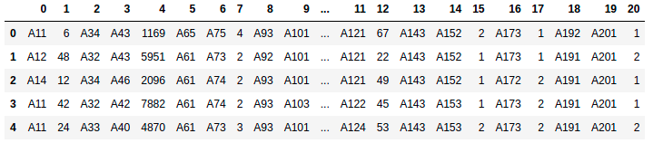
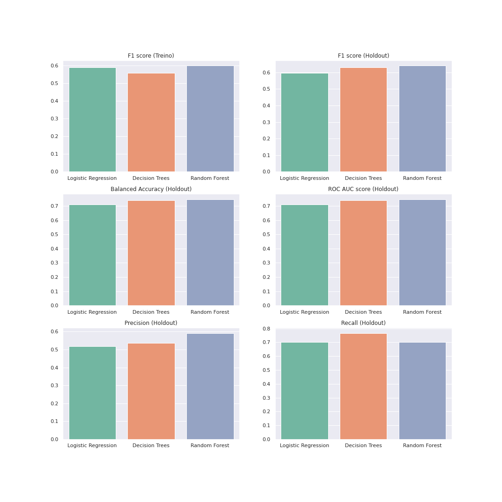
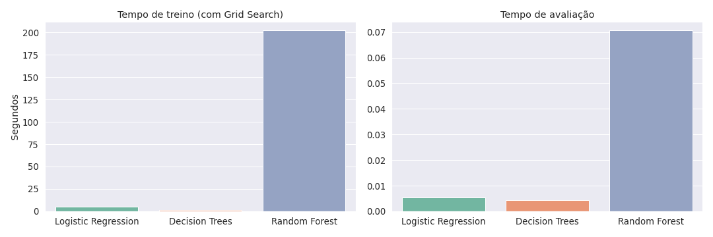

# Statlog Credit Risk Analysis

Aplicando modelos de Machine Learning para classificação do risco de crédito.


## Autor

- [Franklin Oliveira](https://www.linkedin.com/in/franklin-oliveira95/)

## Base de dados

A base de dados trabalhada é a [Statlog (German Credit Data)](https://archive.ics.uci.edu/ml/datasets/Statlog+%28German+Credit+Data%29), disponível no [UC Irvine Machine Learning Repository](https://archive.ics.uci.edu/ml/index.php). 

Nesse *dataset*, indivíduos são classificados como "bons" ou "ruins" de acordo com seu nível de risco de crédito, estimado com base em um conjunto de atributos. Ao todo, tem-se 21 informações (_features_) acerca de 1000 clientes. A imagem a seguir exibe uma prévia do conjunto de dados.



Cada informação é identificada por sua posição na tabela, onde a última coluna representa a variável resposta (risco de crédito). Cada uma das *features* foi nomeada e decodificada segundo o dicionário presente em `./data/german.doc`.

## Introdução

O case visa a elaboração de uma análise preditiva de classificação de clientes solicitantes, avaliados pelo seu risco de crédito (`1 = bom, 2 = ruim`). Portanto, trata-se de um problema de classificação onde serão empregados modelos de aprendizado supervisionado a fim de automatizar o processo decisório de concessão de crédito, buscando minimizar o risco de inadimplência.

Nesse sentido, foi realizada uma análise exploratória de dados e um processo de *feature engineering* a fim de preparar o dataset para aplicação de modelos preditivos. Não foi necessário lidar com *missing values*. 

Três classes de modelos de Machne Learning foram avaliadas: Regressão Logística, Árvores de Decisão e Random Forests. Segundo o `F1 score`, o melhor modelo foi o Random Forest, sendo este o modelo escolhido ao fim desse estudo. 

No entanto, para inserção em um ambiente de produção, deve-se também considerar o tempo computacional tomado por este modelo nas etapas de treino e avaliação em um conjunto de teste/_holdout set_. Não obstante, o Random Forest foi o pior modelo nesse quesito, tornando as _Decision Trees_ e a Regressão Logística alternativas viáveis para inserção em sistemas automatizados, sem sacrificar muita performance. 

## Estrutura

```bash
.
├── data
│   ├── data.pickle                                   # versão pré-processada da base de dados
│   ├── german.data                                   # base de dados (raw)
│   ├── german.doc                                    # descrição da base de dados
├── models                                            # arquivos dos modelos salvos
│   ├── decision_tree.pickle                      
│   ├── decision_tree_holdout_metrics.pickle                      
│   ├── logistic_regression.pickle                      
│   ├── logistic_regression_holdout_metrics.pickle                      
│   ├── random_forest.pickle                          # arquivo do melhor modelo 
│   ├── random_forest_holdout_metrics.pickle          # métricas do melhor modelo no conjunto holdout            
├── notebooks
│   ├── 00_preprocessing_and_feature_engineering.ipynb
│   ├── 01_eda.ipynb
│   ├── 02_decision_trees.ipynb
│   ├── 02_linear_model.ipynb
│   ├── 02_random_forests.ipynb
│   ├── 03_model_comparison.ipynb
├── src                                               # arquivos de ilustração para o README 
├── README.md
├── requirements.txt        
└── proposta.pdf                                      # proposta em PDF
```

## Requerimentos

Todo esse estudo foi desenvolvido no sistema operacional Ubuntu 20.04 LTS, com Python versão 3.8 em uma distribuição Anaconda. No entanto, tomou-se o devido cuidado para que os arquivos notebook sejam executados também em sistemas Windows e Mac OS com Python 3.X instalado, desde que sejam atendidos os requisitos de libraries listados a seguir.

Principais libraries:

```sh
numpy - pandas - swifter - seaborn - matplotlib - statsmodels - sklearn 
```

Todas as bibliotecas necessárias para executar os arquivos de notebook (`.ipynb`) e suas dependências estão listadas no arquivo `requirements.txt`.

Para instalar todos os requerimentos necessários (libraries principais e suas dependências), basta executar o seguinte comando em uma instância de terminal (obs: certifique-se de navegar até a pasta correta):

```bash
pip install -r requirements.txt
```

## Raciocínio de Negócio e Desempenho dos modelos

Nesse estudo, foram avaliadas três classes de modelos para a tarefa de classificação: Regressão Logística, Árvores de Decisão e Random Forest. Vale comentar em mais detalhes a escolha da métrica de avaliação e seleção dos modelos preditivos. 

Quando se está trabalhando com um dataset desbalanceado, em que uma das classes domina as demais (como é o caso neste estudo; 70% dos clientes está classificado como de baixo risco e 30% de alto risco), duas métricas se sobressaem: **F1 score** e **ROC AUC score**. 

As duas métricas alinham-se com o problema de negócio, em que busca-se minimizar as medidas negativas de performance (falsos positivos e falsos negativos) a fim de, por exemplo, reduzir a taxa de inadimplência. Em outras palavras, do ponto de vista da Instituição Bancária (agente que vai conceder um empréstimo ao cliente solititante), quer-se minimizar a ocorrência das seguintes situações:

1. Emprestar recursos a um cliente de alto risco acreditando que este, na verdade, é de baixo risco (falso positivo). Nesse caso, há uma alta probabilidade de inadimplência. 
2. Não conceder empréstimo a um cliente de baixo risco acreditando que este, na verdade, é de alto risco (falso negativo). Nessa situação, o banco deixa de lucrar com os juros do empréstimo que teria baixa probabilidade de inadimplência. 

Ambas as situações afetam a lucratividade da instituição. A **F1 score** é adequada a esta aplicação pois busca minimizar a ocorrência desses 2 cenários ao priorizar, igualmente, precisão e recall. 

A área abaixo da curva ROC também pode ser considerada dado que prioriza o númmero de verdadeiros positivos, minimizando o número de falsos positivos (ainda mais se considerarmos que, o caso 1 é o mais prejudicial à empresa). No entanto, em um dataset desbalanceado, o número de verdadeiros positivos pode ser superestimado (a classe de baixo risco domina a de alto risco na razão 70/30), assim, superestimando também a métrica **ROC AUC score**. 

Por esse motivo, foi empregada a métrica **F1** para selecionar o modelo preditivo na etapa de treino. Foi escolhido o modelo que apresentou melhor desempenho segundo essa métrica em um **3-fold cross-validation** (foram selecionados apenas 3-folds devido ao baixo número de registros). 

Ainda, 20% dos registros foram selecionados para compor o conjunto *holdout*. A figura abaixo ilustra as métricas de performance obtidas para seleção do modelo preditivo (conjunto de treino) e avaliação de performance no conjunto _holdout_: 



<br>

No gráfico acima, vemos que o modelo de Random Forest foi o que atingiu maior escore *F1* no conjunto de treino e, portanto, foi o principal modelo escolhido para esta aplicação. Quando avaliado fora da amostra (no conjunto *holdout*), seu desempenho manteve-se estável, tornando-o um modelo robusto para ambientes de produção. 

No entanto, também é importante considerar os tempos computacionais dispendidos por cada um destes modelos nas etapas de treino e avaliação, dado que este fator pode afetar diretamente a experiência em aplicações. A figura abaixo exibe os tempos computacionais de cada modelo, em segundos:



O Random Forest, por ser um modelo de *ensemble* (mais alta complexidade), obteve um tempo computacional significativamente superior em cada uma das etapas. No entanto, deve-se ressaltar que, a etapa de treino incorpora o *tuning* de hiperparâmetros por meio de um *GridSearch* o que, dependendo da configuração, altera bastante o tempo dispendido. 

Ainda que seu tempo de avaliação também seja superior aos demais, deve-se atentar para o fato de que, ainda assim, situa-se muito abaixo de 1 segundo, o que ainda o mantém como forte candidato para inserção em ambientes de produção. Como a ordem de crescimento do tempo computacional deste modelo também é superior aos demais, para grandes datasets, os modelos de Regressão Logística e *Decision Trees* configuram opções atrativas, sem sacrificar muito poder preditivo. 

**OBS_1**: diferenças de tempo computacional dependem não só do modelo escolhido, mas também das configurações adotadas na etapa de _hyperparameter tuning_.

**OBS_2:** no modelo de Random Forest, foram usados todos os _threads_ disponíveis setando o parâmetro `n_jobs=-1`.

## Possíveis melhorias

- Converter blocos de código reutilizado em funções. Criar um script `.py` e importá-las nos arquivos _notebook_ `.ipynb` quando necessárias. 
- Desenvolver novas _features_ combinando uma ou mais informações presentes no dataset e avaliar se esse mecanismo melhora a performance dos modelos preditivos.
- Estimar um modelo de _boosting_ (ex.: XGBoost) e comparar sua performance com a dos demais modelos.
- Criar _pipeline_ incorporando as etapas de *feature engineering*, treinamento e previsão com `Scikit-Learn` para inserir em ambientes de produção.

## Considerações finais

Vale destacar que a interpretação de uma métrica de avaliação/comparação escolhida (ex.: precisão, _recall_, F1 score, etc.), não deve ser o único fator considerado na tomada de decisão. Questões como a interpretabilidade do modelo afetam significativamente a tomada de decisão de negócios no dia a dia das empresas; Adicionalmente, o tempo computacional também deve ser levado em consideração dado que afeta diretamente a experiência obtida em ambientes de produção, seja em aplicações voltadas diretamente para o usuário final, seja na automação de processos internos.